# System architecture

CryptoAudit finds cryptographic misuse in Python code, proposes repairs and validates each repair
independently. This page shows every major part of the system and how they connect.

## How to read it

- **Frontend** (`frontend/`): the React website. Pages never call the network directly; they use
  `services/`, which send every request to `/api` with the HttpOnly session cookie.
- **API** (`backend/src/cryptoaudit/api/`): FastAPI routes for sign-in, repositories, scans,
  findings and reports. A scan runs in a background worker (`api/jobs.py`) and its progress and
  results are kept in the web store (SQLite).
- **Pipeline** (`pipeline/repository_scan.py`): ingest → analyze → context → repair → integrity →
  validate → decide → explain. Each box is a separate package with explicit inputs and outputs.
- **External services**: GitHub (read-only), an optional language model (Ollama locally, or
  OpenRouter as a hosted fallback), Bandit/Semgrep for scanner evidence, and a Docker sandbox that
  is used only for the research benchmark.

## Design rules this architecture enforces

| Rule | Where |
|---|---|
| **Generate ≠ validate ≠ accept.** Strategies generate, validators collect evidence, only the gates decide. | `repair/`, `validation/`, `validation/gates.py` |
| The language model never detects misuse and never judges a repair. | `analysis/` is deterministic; `gates.py` ignores the LLM |
| Scanner results (V0) are evidence only and never decide the verdict. | `validation/gates.py` |
| Repository code from the website is never executed. | `api/jobs.py`, `pipeline/repository_scan.py` |
| One finding schema for the whole system. | `models/finding.py` |

Related: [02 website scan](02-website-scan-sequence.md) · [07 repair strategies](07-repair-strategies.md) ·
[09 validation and verdict](09-validation-and-verdict.md) · [16 deployment](16-deployment.md)

## Diagram

```mermaid
flowchart LR
    user(["Developer"])

    subgraph FE["frontend/ — React 19 + Vite"]
        pages["Pages<br/>Login · Dashboard · Repositories<br/>Review · Scan results · Finding · Scans"]
        services["services/<br/>api.js · authService · repositoryService · scanService"]
        pages --> services
    end

    subgraph BE["backend/ — Python package cryptoaudit"]
        api["api/<br/>FastAPI app + routes<br/>auth · repos · scans · findings · reports"]
        jobs["api/jobs.py<br/>background scan job"]
        store[("storage/web_store.py<br/>SQLite: users, sessions,<br/>OAuth state, scans, AI texts")]

        subgraph PIPE["pipeline/ — RepositoryScanner"]
            ingest["ingest/<br/>GitHub client · tarball + zip reader"]
            analyzer["analysis/ + rules/<br/>Deterministic CR1–CR5 analyzer"]
            context["context/<br/>Bounded repair context"]
            repair["repair/<br/>S1 hint · S2 template · S3 LLM · S4 migration"]
            integrity["validation/integrity.py<br/>Candidate integrity checks"]
            validation["validation/<br/>V0 scanners · V1 functional<br/>V2 security · V3 compatibility"]
            gates{"validation/gates.py<br/>decide verdict"}
            explain["reporting/explanation.py<br/>Evidence-based why"]
            ingest --> analyzer --> context --> repair --> integrity --> validation --> gates --> explain
        end

        llm["llm/<br/>RoutingLLMClient<br/>Ollama → OpenRouter"]
        scanners["validation/scanners/<br/>Bandit · Semgrep"]
        cli["cli/main.py<br/>analyze · repair · bench · serve"]
        bench["pipeline/benchmark_runner.py<br/>+ storage/sqlite.py (append-only)"]
    end

    github[("GitHub<br/>OAuth + REST API")]
    ollama[("Ollama<br/>local model")]
    openrouter[("OpenRouter<br/>hosted model")]
    sandbox[["Docker sandbox<br/>no network · read-only · nobody"]]

    user --> pages
    services -- "HTTPS /api + HttpOnly session cookie" --> api
    api --> store
    api --> jobs --> PIPE
    jobs --> store
    ingest -- "read-only token" --> github
    repair -. "S3/S4 only" .-> llm
    explain -. "optional plain-language summary" .-> llm
    llm --> ollama
    llm -. "fallback" .-> openrouter
    repair -. "S1 hints" .-> scanners
    validation -- "V0 re-scan" --> scanners
    validation -. "V1–V3 benchmark only" .-> sandbox
    cli --> PIPE
    cli --> bench

    classDef ext fill:#eef2f7,stroke:#8a96a8,color:#1b2430
    classDef decision fill:#fff4e0,stroke:#c98a1b,color:#3a2a05
    class github,ollama,openrouter,sandbox ext
    class gates decision
```

