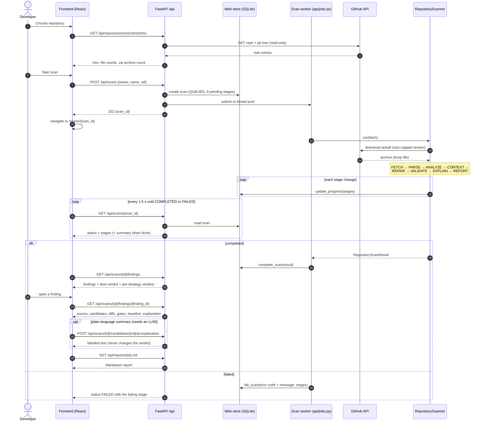

# How a website scan works, end to end

This sequence follows one scan from choosing a repository to reading the results.

## Steps

1. **Review.** The review page asks the API for the repository's file tree (GitHub trees API) so
   you can check it before scanning. The response also counts Python files and `.zip` archives.
2. **Start.** `POST /api/scans` stores a new scan as `QUEUED` with eight pending stages and hands it
   to a background worker. The response (`202`) contains only the scan id. Your GitHub token stays
   in the worker's memory for the duration of the job; it is never written into the scan.
3. **Run.** `RepositoryScanner` downloads the commit's archive and runs the eight stages
   (fetch, parse, analyze, context, repair, validate, explain, report). After every status change it
   writes progress to the web store; on large repositories in-stage progress is throttled.
4. **Follow.** The scan page polls `GET /api/scans/{id}` every 1.5 seconds until the scan is
   `COMPLETED` or `FAILED`.
5. **Results.** The page loads the findings list. Opening a finding loads the original file, every
   strategy's candidate and diff, the validation gates, the scanner baseline and the explanation.
6. **Optional.** A plain-language summary can be requested per candidate (needs a language model).
   It is labelled as AI-written and never changes a verdict. A Markdown report can be downloaded.

## What never happens

- Your repository code is never executed. Without hidden security tests, V2/V3 are `NOT_RUN`, so
  **Unverified is the best possible verdict** for repository code.
- Nothing is written back to GitHub: every GitHub request is a read.

Related: [04 scan lifecycle](04-scan-lifecycle.md) · [05 ingestion](05-ingestion.md) ·
[18 frontend navigation](18-frontend-navigation.md)

## Diagram

