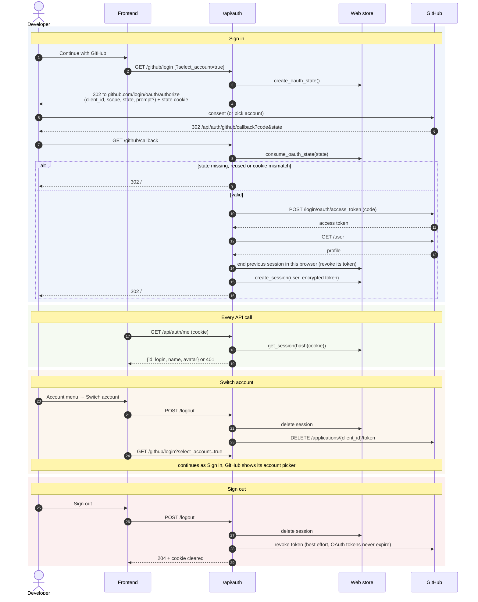

# Sign-in, switching accounts and signing out

CryptoAudit uses a **GitHub OAuth App** (web flow). The backend handles the whole exchange; the
browser only ever holds an HttpOnly session cookie, never the GitHub token.

## Sign in

1. `GET /api/auth/github/login` creates a single-use `state`, stores it server-side **and** sets it
   in an HttpOnly cookie scoped to `/api/auth`, then redirects to GitHub's consent page.
2. GitHub redirects back to `/api/auth/github/callback?code&state`.
3. The callback consumes the server-side state first (so it can never be replayed) and requires the
   cookie copy to match. Otherwise it redirects to `/#/login?error=invalid_state`.
4. The code is exchanged for an access token, the GitHub profile is read, any session still open in
   this browser is ended (and its token revoked), and a new session is created.
5. The browser receives a session cookie (`HttpOnly`, `SameSite=Lax`, `Secure` behind HTTPS) and
   lands on the dashboard.

Any unexpected error in the callback redirects to `/#/login?error=server_error` instead of showing
a bare error page; details go to the server log.

## Switch account

The account menu's **Switch account** (or **Use a different GitHub account** on the sign-in page)
signs out, then starts sign-in with `prompt=select_account`, so GitHub shows its account picker
instead of silently reusing the account you are signed in to on github.com.

## Sign out

`POST /api/auth/logout` deletes the session and revokes the token at GitHub (OAuth App tokens never
expire on their own). Revocation is best effort; you can also revoke access in GitHub settings.

## Storage and scopes

| Item | Stored as |
|---|---|
| Session id (cookie) | hashed in the web store |
| GitHub access token | encrypted at rest (Fernet), server only |
| OAuth state | single use, short-lived |

Scopes: `read:user repo` when `CRYPTOAUDIT_GITHUB_REPO_ACCESS=private` (the default; needed for
private repositories) or `read:user` when `public`. CryptoAudit only ever sends read requests.

## Diagram

