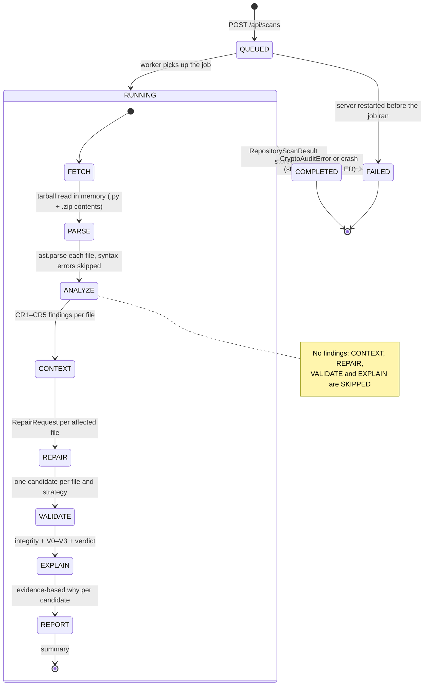

# Scan lifecycle and pipeline stages

A scan record moves through four states: `QUEUED` → `RUNNING` → `COMPLETED` or `FAILED`. While it
runs, `RepositoryScanner` (`pipeline/repository_scan.py`) walks eight stages in order.

## Stages

| Stage | What happens |
|---|---|
| **FETCH** | Download the commit's tarball (size-capped) and read Python files in memory, including `.py` files inside `.zip` archives |
| **PARSE** | `ast.parse` each file; files with syntax errors are listed as skipped |
| **ANALYZE** | Run the deterministic CR1–CR5 rules on every file |
| **CONTEXT** | Build a bounded `RepairRequest` for each file with findings |
| **REPAIR** | Run each strategy (S1, S2, and S3/S4 when a model is available) once per file |
| **VALIDATE** | Integrity checks, scanner baseline and re-scan (V0), V1–V3, verdict |
| **EXPLAIN** | Build the evidence-based explanation for every candidate |
| **REPORT** | Summarise findings, verdicts per strategy and skipped files |

Each stage is `PENDING`, `RUNNING`, `DONE`, `SKIPPED` or `FAILED` and carries a detail line plus
`current/total` counters, which the website shows as a progress timeline. When a repository has
no findings, CONTEXT to EXPLAIN are `SKIPPED`.

## Failure handling

- A `CryptoAuditError` (for example a size limit) or any crash marks the current stage `FAILED` and
  stores the error code and message on the scan.
- Scans left `QUEUED` or `RUNNING` by a previous server process are marked `FAILED` at startup, so
  nothing stays stuck.
- Each user can have one active scan at a time.

## Diagram

