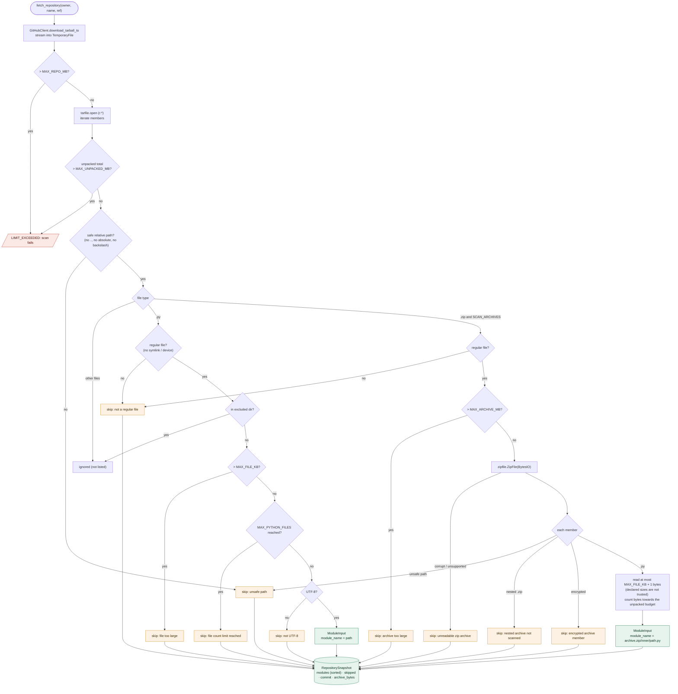

# Repository ingestion

How a GitHub repository becomes the list of Python modules the analyzer sees
(`ingest/git_loader.py`, `ingest/filters.py`).

## How it works

1. The commit's tarball is streamed into an anonymous temporary file, capped at
   `CRYPTOAUDIT_MAX_REPO_MB`. Git history is not downloaded.
2. The archive is read member by member **in memory**. Nothing is extracted to disk and nothing is
   executed.
3. Every byte read counts towards `CRYPTOAUDIT_MAX_UNPACKED_MB`; going over it fails the scan with
   `LIMIT_EXCEEDED` (protection against decompression bombs).
4. Each `.py` file that passes the checks becomes a `ModuleInput(module_name=path, source)`.
5. `.zip` archives in the repository are opened in memory, **one level deep**. Their `.py` members
   become modules named `archive.zip/path/inside.py` and pass the same checks.
6. Everything rejected is recorded as a `SkippedFile` with a reason, which the scan page lists.

## Checks and limits

| Check | Setting / rule | Result when it fails |
|---|---|---|
| Path is relative and safe (no `..`, absolute paths or backslashes) | always | skipped: unsafe path |
| Regular file (no symlinks or devices) | always | skipped: not a regular file |
| Not in an excluded directory (`.git`, `.venv`, `venv`, `env`, `node_modules`, `__pycache__`, `build`, `dist`, `.tox`, `.mypy_cache`, `__MACOSX`) | always | ignored |
| File size | `CRYPTOAUDIT_MAX_FILE_KB` (1024) | skipped: file too large |
| Number of Python files | `CRYPTOAUDIT_MAX_PYTHON_FILES` (5000) | skipped: file count limit reached |
| UTF-8 text | always | skipped: not UTF-8 |
| Archive size | `CRYPTOAUDIT_MAX_ARCHIVE_MB` (100) | skipped: archive too large |
| Archive readable | always | skipped: unreadable zip archive |
| Nested or encrypted archive members | always | skipped with that reason |
| Read `.zip` contents at all | `CRYPTOAUDIT_SCAN_ARCHIVES` (true) | archives ignored |

Sizes inside a zip are checked on the bytes actually read, not on the size the archive declares.

## Diagram

