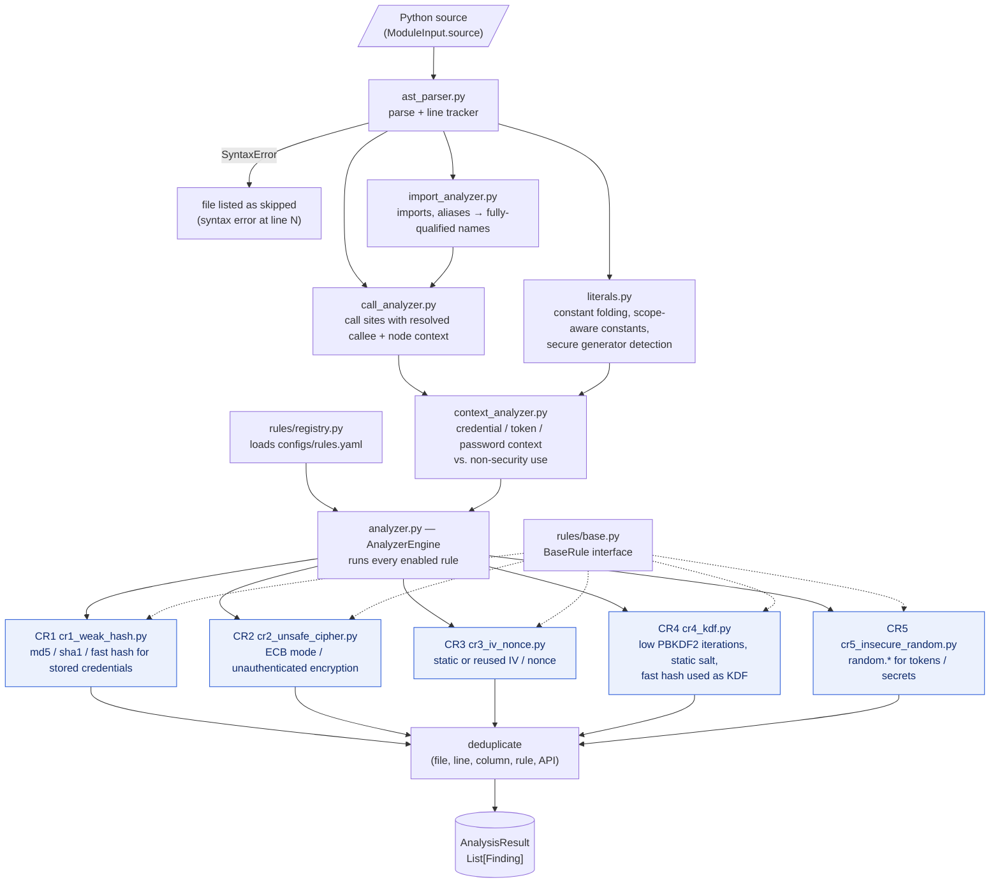

# Deterministic analyzer (CR1–CR5)

Detection is purely static and deterministic: the same source always produces the same findings.
No language model is involved (`analysis/`, `rules/`).

## How it works

1. **Parse** the module into an AST (`ast_parser.py`). A syntax error skips the file.
2. **Resolve imports and aliases** to fully qualified names (`import_analyzer.py`), so
   `from hashlib import md5 as h` is still recognised as `hashlib.md5`.
3. **Collect call sites** with their resolved callee and surrounding node context (`call_analyzer.py`).
4. **Track literals and constants** (`literals.py`): constant folding, scope-aware constants (for
   static IVs and salts) and recognition of secure generators such as `os.urandom` and `secrets`.
5. **Classify context** (`context_analyzer.py`): is a hash used to store a password, or is a random
   value used as a token or secret, as opposed to non-security uses?
6. **Run the rules** loaded by `rules/registry.py` from `configs/rules.yaml`, then deduplicate.

## Rules

| Rule | File | Detects |
|---|---|---|
| CR1 | `cr1_weak_hash.py` | MD5 / SHA-1 / fast hashes used for stored credentials |
| CR2 | `cr2_unsafe_cipher.py` | ECB mode and unauthenticated encryption |
| CR3 | `cr3_iv_nonce.py` | Static or reused IVs and nonces |
| CR4 | `cr4_kdf.py` | Low PBKDF2 iterations, static salts, fast hashes used as a KDF |
| CR5 | `cr5_insecure_random.py` | `random.*` used for tokens, passwords or secrets |

Every rule emits the same `Finding` model: rule id, category, severity, confidence, file, line,
column, matched API, evidence, explanation, remediation and the analyzer/rule versions. A finding's
id is a deterministic hash, so the same finding keeps the same id across scans.

## Diagram

