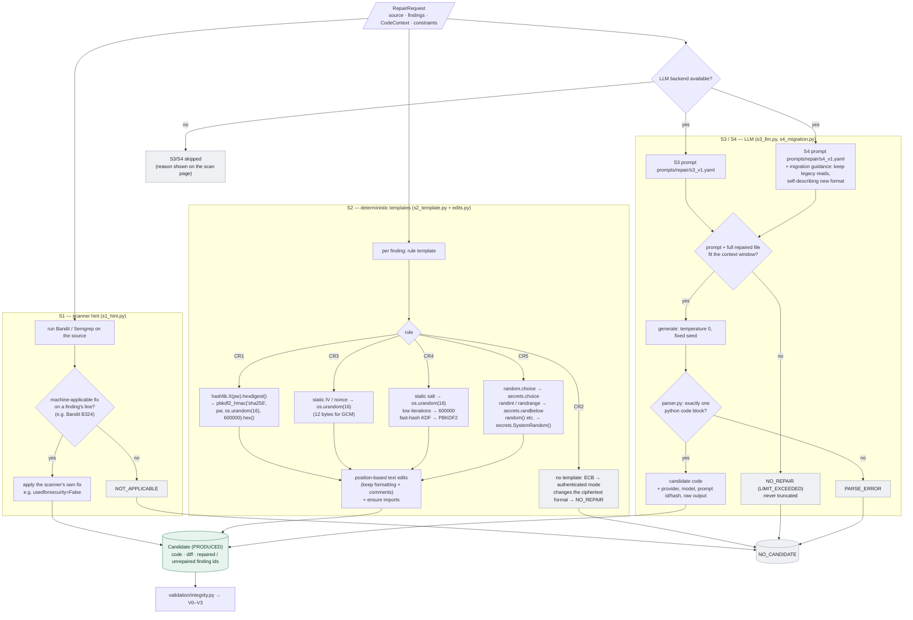

# Repair strategies S1–S4

Every strategy receives the same frozen `RepairRequest` (`repair/request.py`): the module source,
its findings, a bounded code context and the repair constraints. It is built from public input only
and forbids extra fields, so hidden test data cannot reach generation.

## The four strategies

| Strategy | File | How it repairs |
|---|---|---|
| **S1** scanner hint | `s1_hint.py` | Applies a scanner's own machine-applicable fix (e.g. Bandit B324 → `usedforsecurity=False`) when it sits on a finding's line |
| **S2** template | `s2_template.py` | Deterministic, per-rule AST edits that keep formatting and comments |
| **S3** LLM | `s3_llm.py` | Single-shot prompt (`prompts/repair/s3_v1.yaml`), temperature 0, fixed seed, strict parser |
| **S4** migration-aware LLM | `s4_migration.py` | S3 plus guidance to keep legacy data readable (`s4_v1.yaml`) |

## S2 templates per rule

| Rule | Template |
|---|---|
| CR1 | `hashlib.X(pw).hexdigest()` → `hashlib.pbkdf2_hmac("sha256", pw, os.urandom(16), 600000).hex()` |
| CR2 | none: moving from ECB to an authenticated mode changes the ciphertext format → `NO_REPAIR` |
| CR3 | static IV/nonce → `os.urandom(16)` (12 bytes for GCM) |
| CR4 | static salt → `os.urandom(16)`; low iterations → 600000; fast-hash KDF → PBKDF2 |
| CR5 | `random.choice` → `secrets.choice`; `randint`/`randrange` → `secrets.randbelow`; other methods → `secrets.SystemRandom()` |

## Statuses

| Status | Meaning | Becomes |
|---|---|---|
| `PRODUCED` | candidate code exists | validated |
| `NO_REPAIR` | no repair available, or the file does not fit the model's context window (`LIMIT_EXCEEDED`) | `NO_CANDIDATE` |
| `NOT_APPLICABLE` | the strategy does not apply (e.g. no scanner hint for S1) | `NO_CANDIDATE` |
| `PARSE_ERROR` | the model did not return exactly one code block | `NO_CANDIDATE` |

`NO_CANDIDATE` is never counted as success. Strategies are single-shot: validation results are
never fed back into generation. Website scans always run S1 and S2; S3 and S4 run only when a
language model is available, otherwise the scan page lists them as skipped with the reason.

## Diagram

