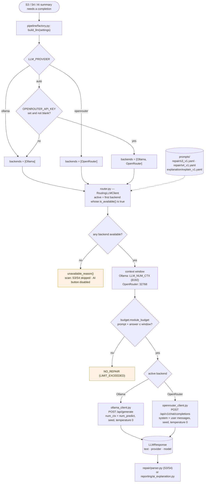

# Language model routing and context budgeting

The language model only writes S3/S4 candidates and the optional plain-language summary. It never
detects misuse and never decides a verdict (`llm/`).

## Choosing a backend

| `CRYPTOAUDIT_LLM_PROVIDER` | Backends tried | Notes |
|---|---|---|
| `ollama` | Ollama | Code never leaves the machine |
| `openrouter` | OpenRouter | Code is sent to OpenRouter and the model provider |
| `auto` (default) | Ollama, then OpenRouter | OpenRouter is added only when a non-blank API key is set |

`RoutingLLMClient` uses the first backend that reports itself available (cached for 30 seconds).
The backend and model that actually answered are recorded on every result
(`generation.provider`, `generation.model`).

## Context budget

The answer must contain the **whole repaired file**, so before calling the model
`llm/budget.py` estimates:

- prompt tokens ≈ characters ÷ 3
- answer tokens ≈ original file tokens × 1.3 + 256

If prompt + answer exceed the context window (Ollama: `CRYPTOAUDIT_LLM_NUM_CTX`, default 8192;
OpenRouter: 32768), the file is recorded as `NO_REPAIR` (`LIMIT_EXCEEDED`). Prompts are never
silently truncated.

## Calls

| Backend | Endpoint | Sent |
|---|---|---|
| Ollama | `POST /api/generate` | prompt, `num_ctx`, `num_predict`, seed, temperature 0 |
| OpenRouter | `POST /api/v1/chat/completions` | system + user messages, seed, temperature 0, max tokens |

## Diagram

