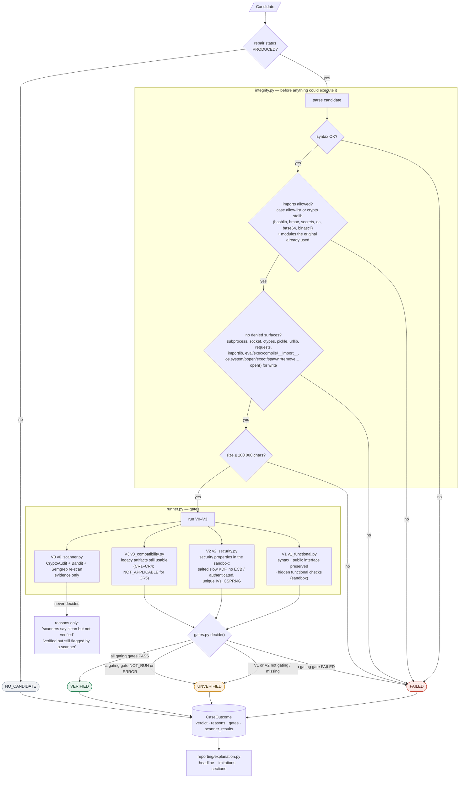

# Integrity checks, validation gates and the verdict

Validation is the authority on whether a repair is acceptable (`validation/`). It runs every gate
independently of anything the strategy claims.

## 1. Integrity (before anything could execute the candidate)

`integrity.py` rejects a candidate that:

- does not parse,
- imports modules outside the allow-list (the case's allowed libraries, or for user code the
  crypto standard library `hashlib`, `hmac`, `secrets`, `os`, `base64`, `binascii`, plus modules the
  original file already imported),
- touches denied surfaces: `subprocess`, `socket`, `ctypes`, `pickle`, `urllib`, `requests`,
  `importlib`, `eval`/`exec`/`compile`/`__import__`, `os.system`/`popen`/`exec*`/`spawn*`/file
  deletion, or `open()` for writing,
- is larger than 100 000 characters.

## 2. Gates

| Gate | File | Checks | Decides the verdict? |
|---|---|---|---|
| **V0** | `v0_scanner.py` | CryptoAudit, Bandit and Semgrep re-scan | No, evidence only |
| **V1** | `v1_functional.py` | Syntax, public interface preserved, functional checks | Yes |
| **V2** | `v2_security.py` | Security properties in the sandbox: salted slow KDF, no ECB / authenticated encryption, unique IVs, CSPRNG | Yes |
| **V3** | `v3_compatibility.py` | Data written by the original code still works (CR1–CR4; not applicable to CR5) | Where the case says so |

## 3. Verdict (`gates.py: decide()`)

| Verdict | When |
|---|---|
| **NO_CANDIDATE** | The strategy produced no code |
| **FAILED** | Integrity failed, or a gating gate failed |
| **UNVERIFIED** | No gating failure, but a gating gate is `NOT_RUN` or `ERROR`, or V1/V2 are missing |
| **VERIFIED** | V1 and V2 pass, and V3 passes where it is gating |

`NOT_APPLICABLE`, `NOT_RUN` and `ERROR` are never treated as a pass. V0 only adds reasons such as
"scanners report the candidate clean, but validation did not verify it". Website scans have no
hidden tests, so V2/V3 are `NOT_RUN` and **Unverified is the best possible verdict** there.

## Diagram

