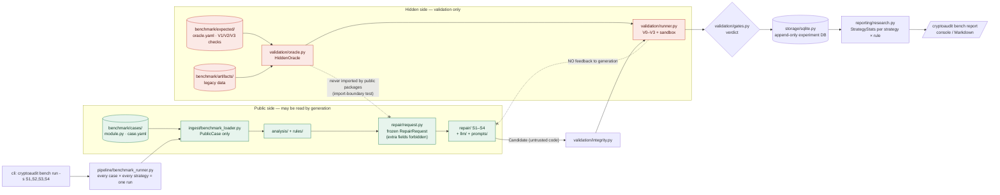

# Research benchmark and the hidden-test boundary

Generation must never see how it will be judged, otherwise a strategy (especially a language model)
could overfit to the tests. The benchmark therefore splits every case into public and hidden parts.

## Layout (`backend/benchmark/`)

| Path | Visibility | Contents |
|---|---|---|
| `cases/<rule>/<id>/` | Public | Vulnerable `module.py` and `case.yaml` (allowed libraries, target Python) |
| `expected/<rule>/<id>/` | Hidden | `oracle.yaml` and the V1/V2/V3 check files |
| `artifacts/<rule>/<id>/` | Hidden | Legacy data written by the original code, used by V3 |
| `results/` | Local | Run output (git-ignored) |

## How the boundary is enforced

- `ingest/benchmark_loader.py` reads only `cases/` and returns a `PublicCase`.
- `validation/oracle.py` is the **only** reader of `expected/` and `artifacts/`.
- An import-boundary test fails if `repair`, `context`, `llm`, `ingest`, `analysis` or `rules`
  imports anything from `validation`.
- Hidden files contain canary strings; tests assert that none reaches a prompt or `RepairRequest`.
- Strategies are single-shot: no validation result is ever fed back to generation.

## Running it

`cryptoaudit bench run -s S1,S2,S3,S4` runs every case with every strategy as one run.
Results go to an append-only SQLite database (`storage/sqlite.py` rejects `UPDATE`/`DELETE`) with
the configuration hash, version, git commit, model, seed, prompt hash, raw model output, candidate
code, diff and gate reports. `cryptoaudit bench report` turns them into per-strategy statistics.

## Diagram

