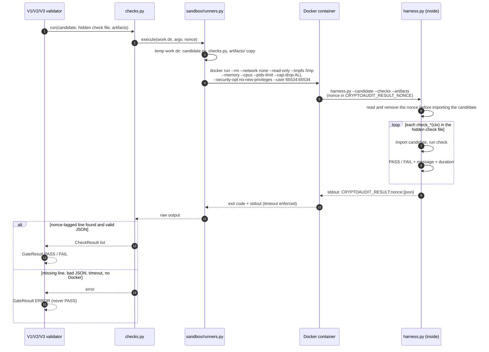

# Sandboxed execution of V1–V3 checks

Only **benchmark** candidates are ever executed, and only after their integrity checks pass.
Website scans of your repositories never reach this step.

## The sandbox

`validation/sandbox/runners.py` copies the candidate, the hidden check file and the artifacts into a
temporary work directory and runs the harness in the `cryptoaudit-sandbox` Docker image with:

- `--network none` (no network)
- `--read-only` plus a small `/tmp` tmpfs
- memory, CPU and process-count limits
- `--cap-drop ALL` and `no-new-privileges`
- user `65534:65534` (nobody)
- a timeout

The local (non-Docker) runner exists for trusted code only and needs an explicit opt-in.

## Result protocol

The harness reads and removes a per-run **nonce** from its environment before importing the
candidate, runs every `check_*` function, and prints one line:
`CRYPTOAUDIT_RESULT:<nonce>:{json}`. Ordinary output cannot be mistaken for a result.

A missing or unparseable result line, a broken check file, a timeout or an unavailable sandbox is
recorded as `ERROR` (the validator could not evaluate), **never** as `PASS`.

## Diagram

