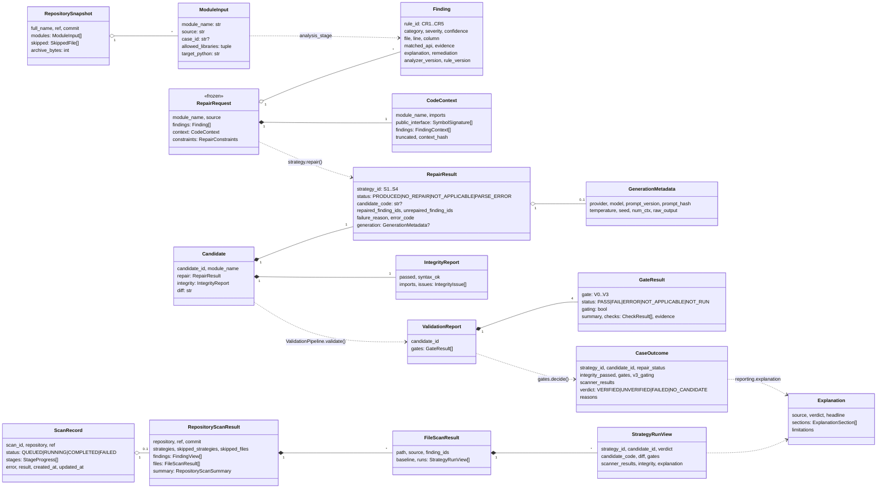

# Core data model

All shared types live in `backend/src/cryptoaudit/models/` (Pydantic v2), with **one
representation per concept**: `Finding` is the only finding schema and every other model refers to
it. `api/schemas.py` only reshapes these models for HTTP responses.

## The main flow of types

| Step | Type | Defined in |
|---|---|---|
| Input file | `ModuleInput`, `RepositorySnapshot` | `scan.py` |
| Detection | `Finding`, `AnalysisResult` | `finding.py`, `analysis.py` |
| Repair input | `RepairRequest` (frozen, extra fields forbidden), `CodeContext` | `repair.py`, `context.py` |
| Repair output | `RepairResult`, `GenerationMetadata`, `Candidate` | `repair.py` |
| Integrity | `IntegrityReport` | `validation.py` |
| Validation | `GateResult` ×4, `ValidationReport` | `validation.py` |
| Decision | `CaseOutcome` with a `Verdict` | `experiment.py` |
| Explanation | `Explanation` | `explanation.py` |
| Website scan | `StrategyRunView`, `FileScanResult`, `RepositoryScanResult`, `ScanRecord` | `scan.py` |
| Benchmark | `CaseSpec`, `PublicCase`, `StrategyStats`, `RunInfo` | `benchmark.py`, `experiment.py` |

## Diagram

