# Backend files (1/3): input, analysis, rules, context and models

Every file in `backend/src/cryptoaudit/` under `ingest/`, `analysis/`, `rules/`, `context/`,
`models/`, `config/` and `utils/`, with what it does. Arrows show the main "uses" relationships.
`__init__.py` files only re-export and are not shown.

| Package | Responsibility |
|---|---|
| `ingest/` | Load code: single files, folders, benchmark cases (public views only) and GitHub repositories (OAuth, read-only API, in-memory tarball and zip reading) |
| `analysis/` | Deterministic analysis: AST, imports, call sites, literals, security context, engine |
| `rules/` | The five rules CR1–CR5, their base class and the registry that loads `configs/rules.yaml` |
| `context/` | Bounded, hashed repair context: enclosing function, imports, constants, callers, public interface |
| `models/` | Shared Pydantic models: one schema per concept |
| `config/` | `Settings` from `CRYPTOAUDIT_*` environment variables or `backend/.env` |
| `utils/` | Structured error codes and deterministic hashing |

Continued in [14 repair and validation](14-backend-files-repair-validation.md) and
[15 API and pipeline](15-backend-files-api-pipeline.md).

## Diagram

```mermaid
flowchart LR
    subgraph INGEST["ingest/ — getting code in"]
        direction TB
        ing_file["file_loader.py<br/>load one .py file + its public config → ModuleInput"]
        ing_dir["directory_loader.py<br/>deterministic discovery of .py files in a folder"]
        ing_filters["filters.py<br/>SnapshotLimits, excluded dirs, safe relative paths,<br/>GitHub name / ref validation"]
        ing_gh["github_client.py<br/>GitHubOAuth (authorize, exchange, revoke)<br/>GitHubClient (user, repos, tree, tarball) — read-only"]
        ing_git["git_loader.py<br/>read .py files (and .py inside .zip) from the tarball<br/>in memory → RepositorySnapshot"]
        ing_bench["benchmark_loader.py<br/>BenchmarkRepository: public case views only"]
        ing_git --> ing_filters
        ing_git --> ing_gh
        ing_dir --> ing_filters
    end

    subgraph ANALYSIS["analysis/ — deterministic analyzer"]
        direction TB
        an_ast["ast_parser.py<br/>parse source, track lines"]
        an_imp["import_analyzer.py<br/>imports + aliases → qualified names"]
        an_call["call_analyzer.py<br/>call sites + resolved callee + node context"]
        an_ctx["context_analyzer.py<br/>credential / token context vs. other use"]
        an_lit["literals.py<br/>constant folding, scope-aware constants,<br/>secure generator detection"]
        an_engine["analyzer.py<br/>AnalyzerEngine: run all rules, dedupe → AnalysisResult"]
        an_engine --> an_ast & an_imp & an_call & an_ctx & an_lit
    end

    subgraph RULES["rules/ — CR1–CR5"]
        direction TB
        r_base["base.py<br/>BaseRule interface"]
        r_reg["registry.py<br/>rule id → class, loads configs/rules.yaml"]
        r1["cr1_weak_hash.py<br/>weak hash for stored credentials"]
        r2["cr2_unsafe_cipher.py<br/>ECB / unauthenticated mode"]
        r3["cr3_iv_nonce.py<br/>static or reused IV / nonce"]
        r4["cr4_kdf.py<br/>weak KDF iterations / static salt"]
        r5["cr5_insecure_random.py<br/>random.* for security tokens"]
        r_reg --> r1 & r2 & r3 & r4 & r5
        r1 & r2 & r3 & r4 & r5 -.-> r_base
    end

    subgraph CONTEXT["context/ — bounded repair context"]
        direction TB
        c_builder["context_builder.py<br/>ContextBuilder → CodeContext (hashed)"]
        c_extract["extractor.py<br/>scopes, imports, module constants"]
        c_symbols["symbol_resolver.py<br/>public interface (also used by V1)"]
        c_calls["call_graph.py<br/>in-module callers of a function"]
        c_budget["context_budget.py<br/>max function lines / total chars, truncation marker"]
        c_builder --> c_extract & c_symbols & c_calls & c_budget
    end

    subgraph MODELS["models/ — one schema per concept (Pydantic v2)"]
        direction TB
        m_enums["enums.py<br/>Severity, Category, Confidence"]
        m_finding["finding.py<br/>Finding (canonical) + finding_id()"]
        m_analysis["analysis.py<br/>RuleConfig, AnalysisResult"]
        m_context["context.py<br/>CodeContext, FindingContext, SymbolSignature"]
        m_repair["repair.py<br/>RepairRequest, RepairResult, Candidate,<br/>RepairStatus, StrategyId, GenerationMetadata"]
        m_valid["validation.py<br/>GateId, GateStatus, GateResult,<br/>ValidationReport, IntegrityReport"]
        m_exp["experiment.py<br/>Verdict, CaseOutcome, StrategyStats, RunInfo"]
        m_expl["explanation.py<br/>Explanation, ExplanationSection"]
        m_scan["scan.py<br/>ModuleInput, RepositorySnapshot, ScanStage,<br/>StageProgress, ScanRecord, RepositoryScanResult"]
        m_bench["benchmark.py<br/>CaseSpec, PublicCase"]
    end

    subgraph SUPPORT["config/ and utils/"]
        direction TB
        cfg["config/settings.py<br/>Settings from CRYPTOAUDIT_* env / backend/.env"]
        u_err["utils/errors.py<br/>ErrorCode + CryptoAuditError"]
        u_hash["utils/hashing.py<br/>deterministic hashes for ids + reproducibility"]
    end

    an_engine --> r_reg
    an_engine --> m_finding & m_analysis
    ing_git --> m_scan
    ing_bench --> m_bench
    c_builder --> m_context
    m_finding --> m_enums
    ing_gh --> u_err
    c_builder --> u_hash
```

