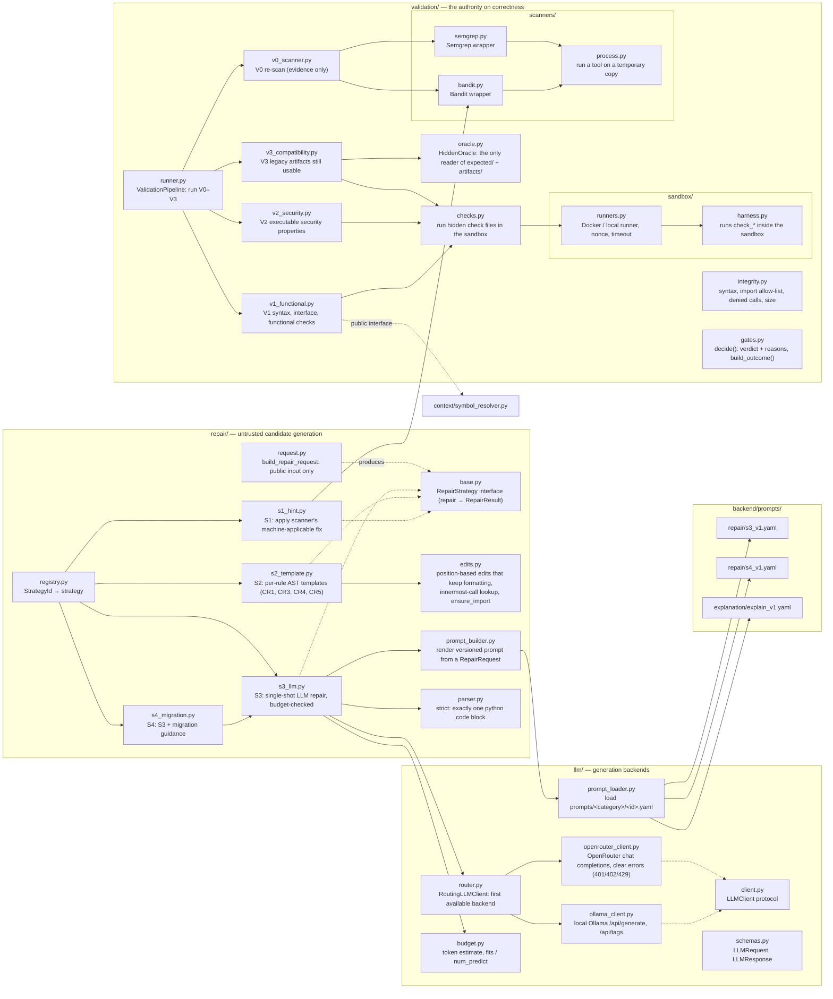

# Backend files (2/3): repair, language model and validation

Every file in `repair/`, `llm/` and `validation/`, plus the versioned prompts in `backend/prompts/`.

Generation (`repair/`, `llm/`) and judgement (`validation/`) are separate packages. Generation-side
packages may not import `validation`; an import-boundary test enforces it.

| Package | Responsibility |
|---|---|
| `repair/` | Build the `RepairRequest`, run S1–S4, apply edits, render prompts and parse model output |
| `llm/` | Model backends (Ollama, OpenRouter), routing between them, token budgeting, prompt loading |
| `prompts/` | Versioned prompt files: `repair/s3_v1.yaml`, `repair/s4_v1.yaml`, `explanation/explain_v1.yaml` |
| `validation/` | Integrity checks, V0–V3 gates, the verdict, hidden-test access, sandbox and scanner wrappers |

See [07 repair strategies](07-repair-strategies.md), [08 LLM routing](08-llm-routing.md),
[09 validation](09-validation-and-verdict.md) and [11 sandbox](11-sandbox-execution.md) for how
these files work together.

## Diagram

