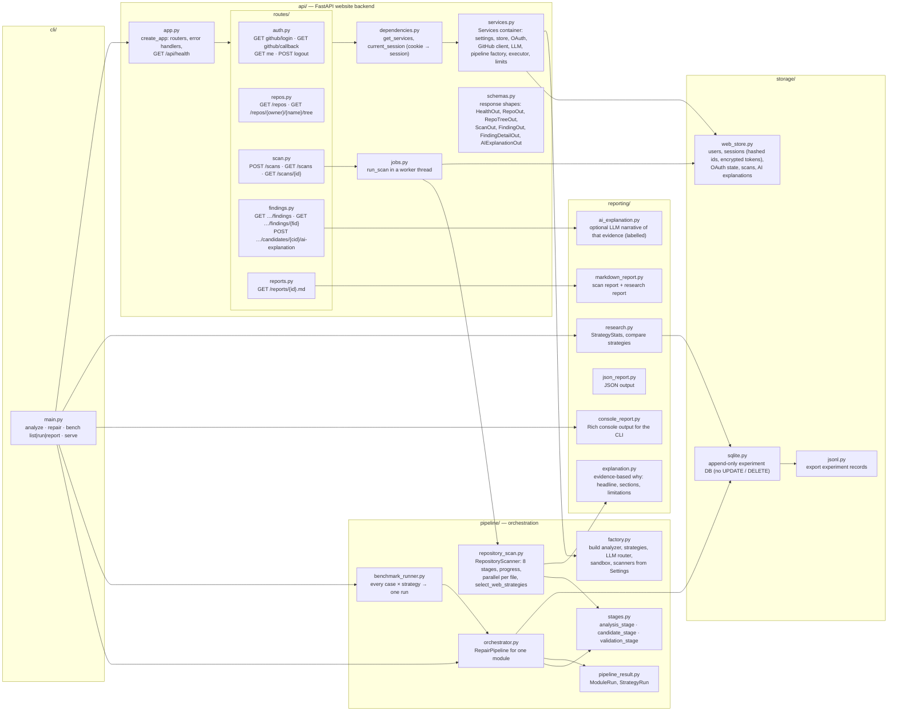

# Backend files (3/3): API, pipeline, reporting, storage and CLI

Every file in `api/`, `pipeline/`, `reporting/`, `storage/` and `cli/`. All HTTP routes are mounted
under `/api` by `api/app.py`.

| Package | Responsibility |
|---|---|
| `cli/` | `cryptoaudit analyze`, `repair`, `bench list/run/report` and `serve` |
| `api/` | FastAPI app, dependency container, session handling, background scan jobs, response schemas, routes |
| `pipeline/` | Stage functions, one-module pipeline, repository scanner, benchmark runner, wiring from settings |
| `reporting/` | Evidence-based explanations, optional AI narrative, Markdown/JSON/console reports, research statistics |
| `storage/` | Web store (users, sessions, OAuth state, scans, AI texts) and the append-only experiment database |

## API endpoints

| Method | Path | Purpose |
|---|---|---|
| GET | `/api/health` | Server, GitHub and language model status |
| GET | `/api/auth/github/login` | Start sign-in (`?select_account=true` to switch account) |
| GET | `/api/auth/github/callback` | Finish sign-in, set the session cookie |
| GET | `/api/auth/me` | Signed-in user |
| POST | `/api/auth/logout` | End the session and revoke the token |
| GET | `/api/repos` | Repositories you can scan |
| GET | `/api/repos/{owner}/{name}/tree` | File tree and counts |
| POST | `/api/scans` | Start a scan |
| GET | `/api/scans`, `/api/scans/{id}` | Scan list, progress and summary |
| GET | `/api/scans/{id}/findings`, `/api/scans/{id}/findings/{fid}` | Findings and per-finding detail |
| POST | `/api/scans/{id}/candidates/{cid}/ai-explanation` | Optional plain-language summary |
| GET | `/api/reports/{id}.md` | Markdown report |

## Diagram

