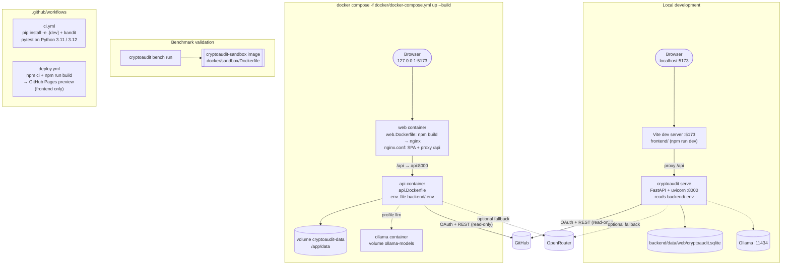

# How CryptoAudit runs: development, Docker Compose and CI

## Local development

Vite serves the frontend on `http://localhost:5173` and proxies `/api` to `cryptoaudit serve`
(default port 8000; set `CRYPTOAUDIT_API_URL` to use another). Serving the site and the API from one
origin keeps the HttpOnly session cookie working and lets one GitHub OAuth callback URL
(`http://localhost:5173/api/auth/github/callback`) serve both setups.

## Docker Compose

`docker compose -f docker/docker-compose.yml up --build` starts:

| Service | Image | Role |
|---|---|---|
| `web` | `docker/web.Dockerfile` (build + nginx) | Serves the built frontend on `127.0.0.1:5173` and proxies `/api` to `api` |
| `api` | `docker/api.Dockerfile` | FastAPI backend, reads `backend/.env`, stores data in the `cryptoaudit-data` volume |
| `ollama` | `ollama/ollama` | Optional local model, only with `--profile llm` |

The validation sandbox image (`docker/sandbox/Dockerfile`) is built separately and used only by the
research benchmark.

## Continuous integration

| Workflow | What it does |
|---|---|
| `.github/workflows/ci.yml` | Installs the backend with Bandit and runs the tests on Python 3.11 and 3.12 |
| `.github/workflows/deploy.yml` | Builds the frontend and publishes a static preview to GitHub Pages (frontend only) |

## Diagram

