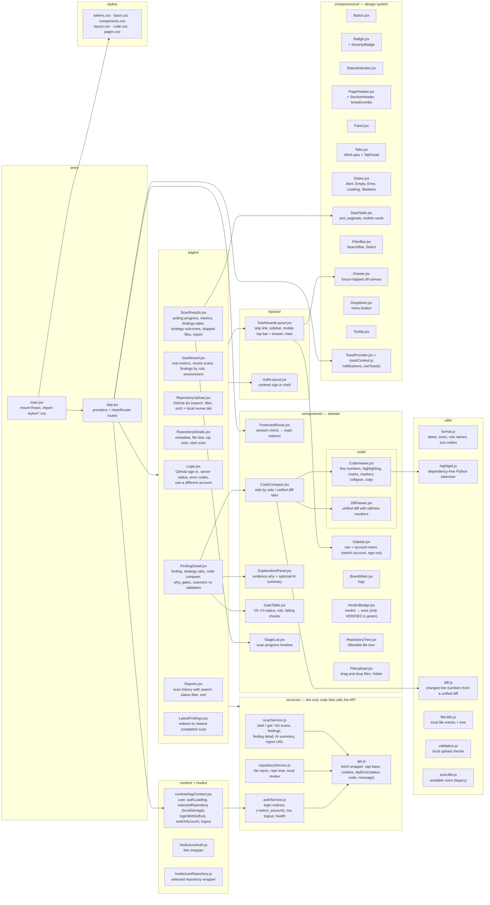

# Frontend files

Every file in `frontend/src/` and what it does. The website uses React 19, Vite, React Router
(hash routes), `lucide-react` icons and plain CSS.

## Layering

| Layer | Folder | Rule |
|---|---|---|
| Pages | `pages/` | One per route; compose components and call services |
| Domain components | `components/` | CryptoAudit-specific UI (code compare, gates, verdicts, tree, explanation) |
| Design system | `components/ui/` | Generic, reusable building blocks with no API knowledge |
| Code viewing | `components/code/` | Code viewer and diff viewer |
| Services | `services/` | The only code that talks to the backend; every call goes to `/api` |
| State | `context/`, `hooks/` | Signed-in user, selected repository, sign-in / switch / sign-out |
| Styles | `styles/` | Design tokens, base, components, layout, code and page CSS (light and dark) |
| Utilities | `utils/` | Formatting, syntax highlighting, diff parsing, local file helpers |

`utils/sizeUtils.js` is a legacy helper that no page imports.

## Diagram

