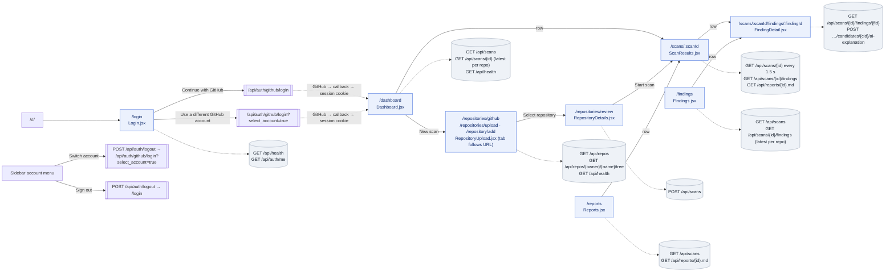

# Frontend routes, pages and API calls

The website uses hash routes (`frontend/src/App.jsx`). Every route except `/login` is wrapped in
`ProtectedRoute`, which waits for `GET /api/auth/me` and sends signed-out users to the login page.
`/` goes to `/login` (which forwards signed-in users to the dashboard) and unknown routes go to
`/dashboard`.

| Route | Page | Purpose |
|---|---|---|
| `/login` | `Login.jsx` | Sign in with GitHub, or with a different GitHub account |
| `/dashboard` | `Dashboard.jsx` | Metrics from your scans, recent scans, findings by rule, environment |
| `/repositories/github`, `/repositories/upload`, `/repository/add` | `RepositoryUpload.jsx` | Choose a GitHub repository, or review local files (the tab follows the URL) |
| `/repositories/review` | `RepositoryDetails.jsx` | Check the repository and start a scan |
| `/scans/:scanId` | `ScanResults.jsx` | Progress, summary, findings table, strategy outcomes, report |
| `/scans/:scanId/findings/:findingId` | `FindingDetail.jsx` | Original vs repaired code, why, gates, scanner comparison |
| `/reports` | `Reports.jsx` | Scan history and Markdown reports |
| `/findings` | `Findings.jsx` | Every finding from the latest completed scan of each repository, with search and filters |

## Diagram

