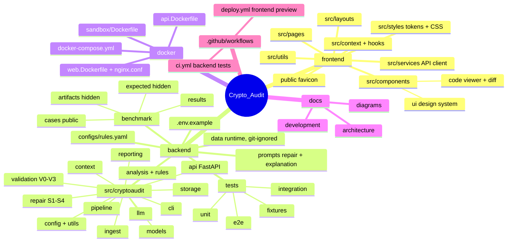

# Repository layout at a glance

Run backend commands from `backend/` (relative paths such as `.env`, `data/` and the test fixtures
resolve from there) and frontend commands from `frontend/`.

| Folder | Contents |
|---|---|
| `frontend/` | React website |
| `backend/` | Python package `cryptoaudit`, tests, benchmark, rule configuration, prompts |
| `docker/` | API and web images, nginx configuration, docker-compose, validation sandbox |
| `docs/` | `architecture/`, `development/` and these diagrams |
| `.github/workflows/` | Backend tests and the frontend preview deployment |

## Diagram

